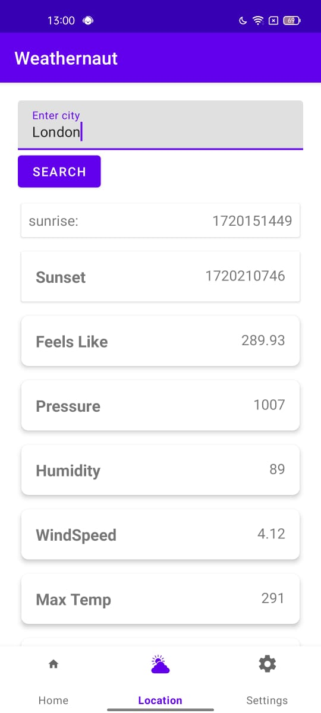
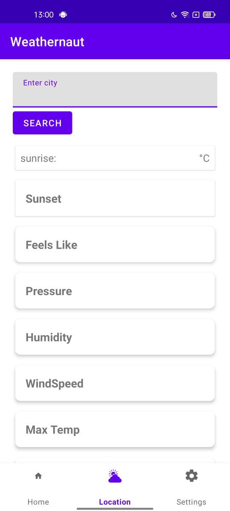

## Weathernaut
A simple weather app that displays forecast for the current day.
and 3 hour interval  weather forecast.Also find the weather of a specific City.

## screenshot

 

## Technologies
Language : Kotlin
UI:XML,Glide
Data: Retrofit 