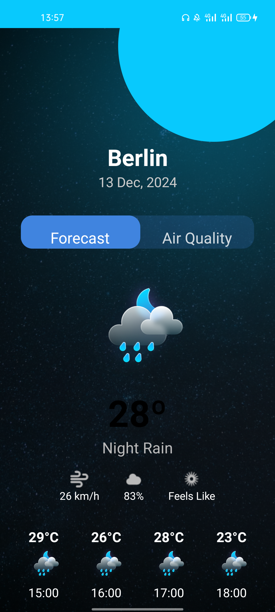

## Weathernaut
A  weather app that fetches and displays weather forecast for the current day(24hr) from the 
[OpenWeatherMap](https://openweathermap.org/api).           
Built with kotlin.

## screenshot



# Set up Requirements
Obtain your key from [OpenWeatherMap](https://openweathermap.org/api) and replace it in the local.properties file

 ```gradle
    API_KEY=API_KEY_VALUE
```

## Build and Run Weathernaut
1. Clone the repository.


2. Open the project in Android Studio.


3. Sync the Gradle files and run the app module.


## 🔧  Built with

- **Language:** Kotlin
- **Architecture:** MVVM (Model-View-ViewModel)
- **UI Framework:**  XML + Material Design
- **Networking:** Retrofit
- **Asynchronous Tasks:** Kotlin Coroutines
- **Navigation:** Navigation Component
- **Libraries** Glide


## ✨ Features
- 🔄 **Real-time News Fetching**  
  Fetches the latest weather from the [OpenWeatherMap](https://openweathermap.org/api)  .


- 🔀 **Seamless Screen Navigation**  
  Smooth transitions and navigation between screens using Android Navigation components.


- 🔍 **Search Functionality**   
  Easily find different City's air quality levels .


##  Contributing
Contributions are welcome! Feel free to fork the repo, open issues, and submit pull requests


